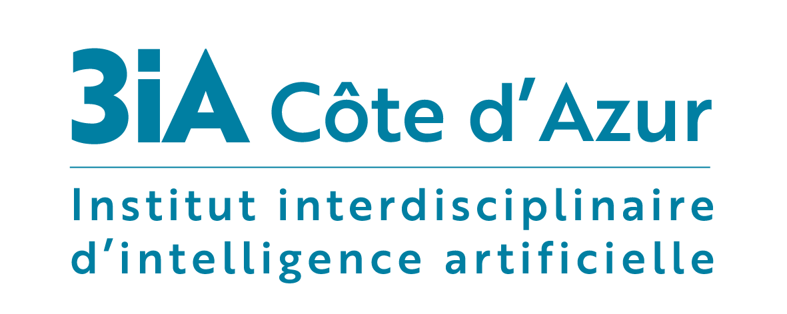
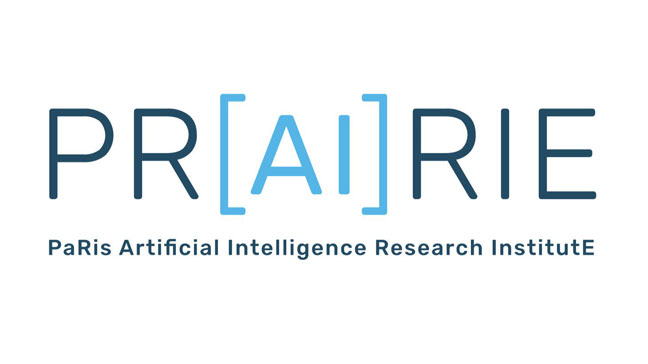

## Join us for the fourth edition of the Virtual OTML Workshop @ NeurIPS!

Over the last few years, **optimal transport** (OT) has quickly become a central topic in
machine learning. OT is now routinely used in many areas of ML, ranging from the theoretical use of
OT flow for controlling learning algorithms to the inference of high-dimensional cell trajectories
in genomics. The **OTML workshop series (in ’14, ’17, ’19)** has been instrumental in shaping this
research thread. For this new installment of OTML, we aim even bigger by **hosting an exceptional
keynote speaker, Alessio Figalli,** who received the 2018 Fields Medal for his breakthroughs in the
analysis of the regularity properties of OT. OTML will be a unique opportunity for **cross-fertilization
between recent advances in pure mathematics and challenging high-dimensional learning problems**.

The format of the workshop will encourage **discussion** and **presentation of contributed content** in addition to our lineup of **invited talks**.

### Invited Speakers

##### Plenary Speakers
- [Alessio Figalli](https://people.math.ethz.ch/~afigalli/) (ETH Zurich)
- [Caroline Uhler](https://www.carolineuhler.com) (MIT)
- [Lénaïc Chizat](https://lchizat.github.io) (EPFL)

##### Keynote Talks
- [Beatrice Acciaio](https://people.math.ethz.ch/~beacciaio/) (ETH Zurich)
- [Chin-Wei Huang](https://chinweihuang.com) (MILA)
- [Pinar Demetci](https://pinardemetci.github.io) (Brown)
- [Yongxin Chen](https://yongxin.ae.gatech.edu) (Georgia Tech)
- [Yunan Yang](https://cims.nyu.edu/~yy38/) (Courant)

### Past Editions
- [OTML'19](https://sites.google.com/view/otml2019/home)
- [OTML'17](http://otml17.marcocuturi.net/)
- [OTML'14](http://www.iip.ist.i.kyoto-u.ac.jp/OTML2014/doku.php)

### Partners

